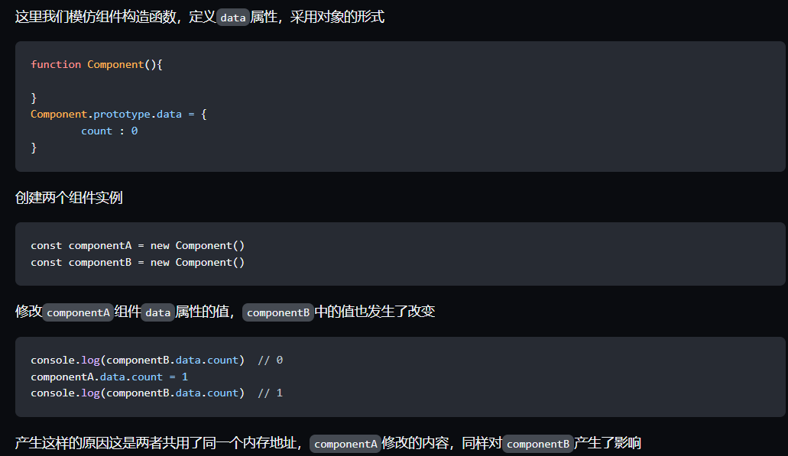

- `vue`实例的时候定义`data`属性既可以是一个对象，也可以是一个函数
- 组件中定义`data`属性，只能是一个函数
	- 目的是为了防止多个组件实例对象之间共用一个`data`，产生数据污染。采用函数的形式，`initData`时会将其作为工厂函数都会返回全新`data`对象
	- `Component.prototype.data = {count : 0}`
- 
-
- ## 新增属性不引起页面刷新
	- `vue2`是用过`Object.defineProperty`实现数据响应式
	- 但是我们为`obj`添加新属性的时候，却无法触发事件属性的拦截
	- 新增的属性，并没有通过`Object.defineProperty`设置成响应式数据
	- ### 解决方案
		- Vue.set()
		- Object.assign()
			- 应创建一个新的对象，合并原对象和混入对象的属性
		- $forcecUpdated()
			- `$forceUpdate`迫使` Vue` 实例重新渲染
	- `vue3`是用过`proxy`实现数据响应式的，直接动态添加新属性仍可以实现数据响应式
-