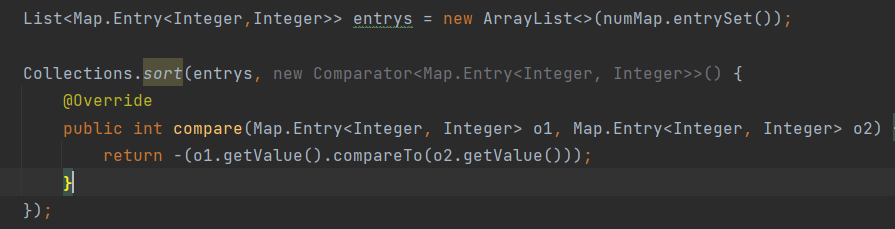

tags::  leetcode , stack,queue

- ## 题目
- > 给你一个整数数组  `nums`  和一个整数  `k`  ，请你返回其中出现频率前  `k`  高的元素。你可以按 **任意顺序** 返回答案。
## 要求
- > 你所设计算法的时间复杂度 **必须** 优于  `O(n log n)`  ，其中  `n` * *是数组大小。
## 需要了解
	- [[PriorityQueue]]提供堆数据结构，具有比较器，默认排序为升序（小顶堆），实现了[[Queue]]。
	- [[Comparator]]是比较器
		- `Integer1.compareTo(Integer2)`
			- Integer1小于Integer2返回-1
	- /._| - |_.\
## 分析
- 先遍历整个数组，将每个num的出现次数count存储起来。时间复杂度为O(N)
- 要挑出count前k的元素，就需要进行排序,并将排序前k的num存储起来。时间复杂度要求小于O(NlogN)
	- 对map进行按值排序后输出
		- 
		- 重写比较器（默认升序，改为降序），比较的时键值对的“值”，即count。得到降序的数组。
		- 时间复杂度为O(NlogN)
	- 使用小顶堆
		- 实现PriorityQueue<int[]>，元素是键值对，重写比较器（比较的值为键值对中的值），但需要小顶堆，则不需要修改比较结果。
		- 注意堆的元素个数size()不会大于k。当size小于k时，无脑插入。等于k的时候，弹出一个，再插入一个，size依旧为k。
		- 遍历map.entrySet()键值对，如果遍历的count大于小顶堆peek()的count，则需要弹出poll()顶值，并将遍历的元素插入小顶堆（可以自动排序）。进行一次堆操作时间复杂度为O(logk)，**堆内元素不超过k**。
- 结果数组res，循环k次得到。时间复杂度为O(k)（数组和队列存取均为O(1)）
## 代码
- ```
  package com.lc.nov;
  
  import java.util.*;
  
  /**
   * @PROJECT_NAME: ZCode
   * @DESCRIPTION:
   * @USER: mhl
   * @DATE: 2022/11/21 14:37
   */
  public class Solution {
      public int[] topKFrequent(int[] nums, int k) {
          Map<Integer,Integer> numMap = new HashMap<>();
  
          for(int num :nums){
              numMap.put(num,numMap.getOrDefault(num,0) + 1);
          }
  
          //PriorityQueue 提供堆数据结构
          //元素是数组必须重写比较器
          PriorityQueue<int[]> queue = new PriorityQueue<int[]>(new Comparator<int[]>() {
              @Override
              public int compare(int[] o1, int[] o2) {
                  return o1[1] - o2[1];//次数1 - 次数2 小顶堆
              }
          });
  
          //堆的大小最大为k，每次堆操作需要O(log k)的时间，共需O(n*logk)
          //entrySet是键值对集合，keySet是键的集合
          for (Map.Entry<Integer,Integer> entry : numMap.entrySet()){
                  int num = entry.getKey();
                  int count = entry.getValue();
  
                  //queue开始为空
                  if(queue.size() == k){//大小等于k时，检查堆顶元素（应该为最小的）
                      if(queue.peek()[1] < count){//小于count的话，应该弹出他，并且插入一个新的，新的将重新参与排序
                          queue.poll();
                          queue.offer(new int[]{num,count});
                      }
                  }else{//大小小于k时，无脑插入
                          queue.offer(new int[]{num,count});
                  }
          }//遍历结束后，queue中只有k个元素，
  
          //时间复杂度为O(N*logN)的操作可以不适用小根堆
          //queue.addAll();//每进行一次堆操作时间复杂度为O(logN)
  
  
  
          int[] res = new int[k];
          for(int i = 0;i<k;i++){
              res[i] = queue.poll()[0];
          }
  
  
  //        //直接对map进行排序
  //        List<Map.Entry<Integer,Integer>> entrys = new ArrayList<>(numMap.entrySet());
  //
  //        Collections.sort(entrys, new Comparator<Map.Entry<Integer, Integer>>() {
  //            @Override
  //            public int compare(Map.Entry<Integer, Integer> o1, Map.Entry<Integer, Integer> o2) {
  //                return -(o1.getValue().compareTo(o2.getValue()));
  //            }
  //        });
  //
  //        int[] res = new int[k];
  //        for(int i = 0;i<k;i++){
  //            res[i] = entrys.get(i).getKey();
  //        }
  
          return res;
  
      }
  }
  
  
  
  ```
-