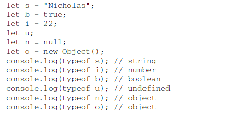
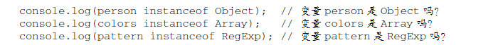
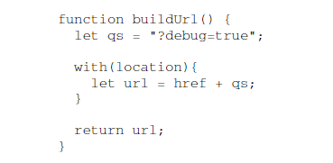
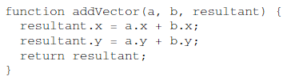

- ## ((63bc00e6-7457-464c-b735-9fce29da28e7))
- ((63bc00fb-de43-412c-93f2-e5c74c7f8346))
- ((63bc0102-b67e-4721-964a-0707147bb228))
- ((63bc0133-d23b-4dcf-8537-4ac727b24273))
-
- ((63bc0183-6944-43e0-9cd5-de3cadea3c20))
-
- ### ((63bc018d-50be-4577-917f-7c0f3b8aa5d3))
- ((63bc01c8-546e-4484-8811-6bcbb696e597))
- ((63bc01e8-bef1-4167-bf71-30ab4f9cb180))
- ### ((63bc0329-7793-46b6-88a8-74bacb1af594))
- ((63bc0206-c2f8-4455-99ba-ac8b79767fdb))
- ### ((63bc0334-9135-46fa-823d-50197cc6db07))
- ((63bc02ca-9e82-45bc-97cb-83f9bd6953d6))
- 当对象作为传递给函数时，实际上传递的是值
	- ((63bc0347-abea-4a3a-9996-d4c660f72ea8))
- ### ((63bc0350-2c24-4ed9-b206-9e7d7062f6e3))
- `typeof`对原始值很有用，对引用值作用不大
	- 
- `instanceof`操作符
	- 
- ((63bc0411-ef6d-4a96-ad36-6206d2d6837e))
- ((63bc0428-bec7-4538-b864-d457a1e4311f))
- ((63bc0438-ea70-4f0e-845a-aef946d8a7e7))
	- Chrome会返回function
- ## ((63bc0452-9e02-4750-acf8-a591f04e3eca))
- ((63bc04a4-645c-4661-bfc8-e33a0a0edfaa))
- ((63bc05c8-1af4-423b-8be8-d1ddf1ccde6b))
	- Window对象，所有通过var定义的全局变量和函数都会成为window对象的属性和方法，使用let和const不会
	- 全局上下文在应用程序退出前才会被销毁
- ((63bc0746-f5a1-46b3-a025-1e6d825d0d3b))
	- 代码执行流进入函数时，函数的上下文就会推到一个上下文栈上
- ((63bc079d-1d56-456c-9361-ebf32137318c))
- ((63bc07c4-cb75-47f4-8b43-1d688ef70add))
- 父上下文访问不到子上下文的变量
- ### ((63bc08d5-5485-4359-9a24-1f7e7d232c03))
- ((63bc0913-b2b2-4f86-991f-2483259306bd))
	- ((63bc0923-246e-4534-a835-5b45d1adb370))
	- ((63bc0929-a5cc-4993-9d2e-13125171579a))
		- 
		- `herf`是`location.href`,`qs`是上文定义的`qs`
- ### ((63bc0a34-2963-402d-ab4c-3ed9c11c6c84))
- ((63bc0a47-6c43-4097-9714-6dc2cfded1b8))
- ((63bc0ad4-7a11-41bc-9bea-5bd8effd83e5))
- ((63bc0b02-d799-471d-9f4b-659f64cc4686))
- ((63bc0be4-bdca-4f6e-9e89-c813c1010c42))
	- 不用考虑变量是否已经声明就可以使用
-
- ((63bc0c2d-e78e-445e-be5a-8893dcf9e022))
- 重复的let声明会抛出syntaxError；重复的var声明会被忽略
- ((63bc0cdb-1f30-426e-b3b6-31d840880b9e))
-
- ## ((63bc0db2-6a64-4939-a798-94f1043416b7))
- ### ((63bc0dc5-d9c7-411d-b66a-55ab13e4625a))
- ((63bc0f52-6311-4d99-9bba-e863b361e33e))
- ### ((63bc0f5e-7bef-4c35-91f6-d02818ac434d))
- 对每个值都记录它被引用次数。
- 声明变量并给它赋一个引用值是，引用数为1
	- ((63bc1137-3920-4f59-b512-d471262495f2))
	- ((63bc1140-2c06-4469-b08e-bf62922610a3))
- ((63bc115c-f35c-42d7-a1e4-8e43fa7d53bf))
	- ((63bc11cf-c53c-4d11-81be-01171fafb985))
- ### ((63bc11d8-86fd-4c8e-82e8-83f8ab1dc595))
- ((63bc1231-86f5-4e72-8ad3-d132f0d86743))
- ((63bc127a-7518-4648-b954-a8b05c39fe44))
- ((63bc1292-b061-4e55-99f8-d4fe3ef100a3))
- ### ((63bc1371-87ef-49b5-b7d7-7db45049d022))
- ((63bc1386-0ce9-4e25-9402-5312e820eda5))
	- 最适用于全局变量和全局对象的属性
- ((63bc1436-4560-44ea-8fa9-a7454704f510))
- const和let都以块为作用域，提高性能
- ((63bc15e5-dfca-4a4e-95b5-31706aa5c48d))
	- ((63bc160b-4f6d-46fd-869a-e6e99031f8a5))
-
- ((63bc165a-b480-45c0-a458-5a3e3ff096b1))
- ((63bc1676-162a-4c17-a2c9-ce3fca2948dc))
- ((63bc1782-8e34-468e-a63e-a1e014cae268))
-
- ((63bc17c1-c32e-42ed-bc4c-f36e4f02be04))
	- ((63bc17e3-4c7e-4cfb-ba38-bb854d518fef))
		- · 
	- ((63bc1808-e17f-4aa7-80ed-fd865338a7ed))
	- ((63bc1853-a0b0-4d79-9872-cb88dbb70e15))
- ## ((63bc1876-9120-4818-a83b-7ce170667e05))
-