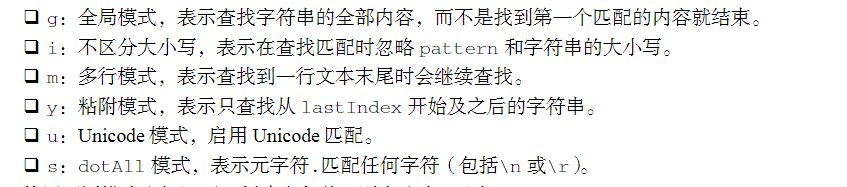
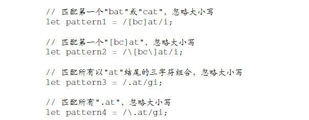
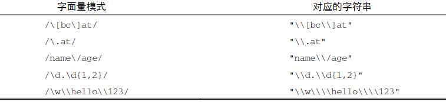
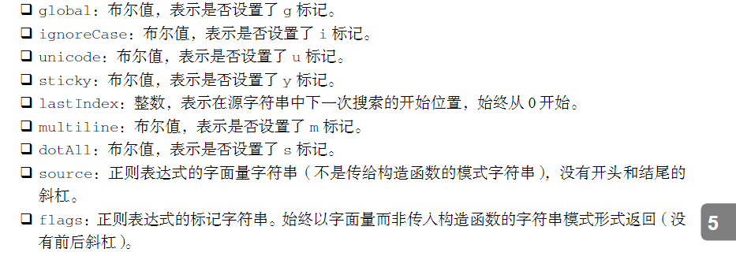
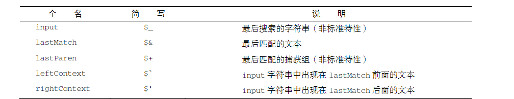
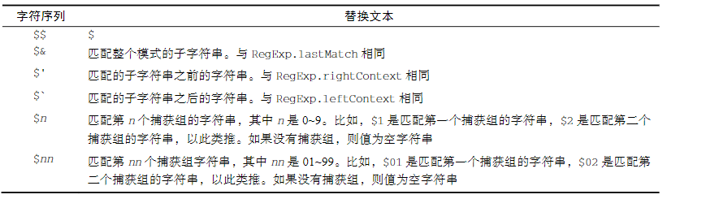
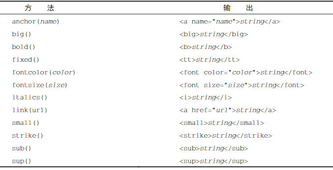
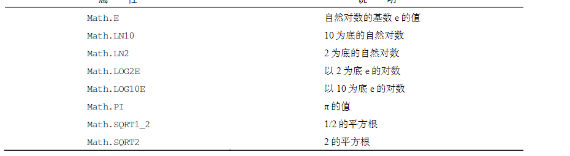

- ((63bd5ef7-47b4-4519-a0ef-25e198499ea7))
- ((63bd5f3f-a101-4b6b-86e8-9b427b2a5bdc))
-
- ## ((63bd5f4d-d314-4341-92a2-14522ea031c0))
- `let now = new Date();`
- `Date.parse()`
	- 接收一个表示日期的字符串参数，返回毫秒表示
- `Date.UTC()`
	- 年、月必需（零起点月数）
- `Date.now()`
	- 返回方法执行日期和时间的毫秒数
	-
- ### ((63bd6093-8db6-4e00-a459-c80320068578))
- ((63bd60af-148b-4768-b597-494f86b19a41))
- ((63bd60ba-2f68-4c3f-ba46-d3d95815cab6))
- ((63bd60c7-b957-485d-b16d-683440657ca6))
-
- ### ((63bd6104-68a8-4f04-a2eb-43c7b50922bc))
-
- ### ((63bd6117-1e9b-4b45-9bd3-5a798016310b))
-
- ## ((63bd6164-4c6b-47d6-950b-0837a7cdab5d))
- `let expression = /pattern/flags;`
- 匹配模式的标记flags
	- 
- ((63bd6233-647d-450b-a7c0-f113e829543f))
	- 
- ((63bd629a-232c-4b78-aa1d-0d2b6834b66f))
	- ((63bd62d4-33c8-458c-ae9e-638849f676e7))
	- 
- ((63bd62fe-148a-497b-8776-72675bf24cf4))
-
- ### ((63bd6322-68b0-413f-8dc6-150213da96b7))
- 
-
- ### ((63bd6403-0f59-4930-ab58-1ebaaaff423f))
- ((63bd6413-93f2-4196-bc7e-a75296d50d5b))
- ((63bd65d2-047d-4cc0-80d4-47a579c66cdb))
-
- ((63bd66bf-f9fc-4bb2-af99-799ec906130e))
-
- ((63bd6711-b721-4cfc-a8a9-b231049b9142))
-
- ### ((63bd6718-34dd-4f80-b598-767393920bf7))
- 
- ((63bd676b-e44a-4767-bc65-921e9b42ef9a))
-
- ((63bd67aa-2dfc-4afd-8127-b63ef6d2147d))
-
- ### ((63bd67b1-e6ba-4a10-8fa7-8f975400506b))
-
- ## ((63bd67ba-0a2b-482f-9fd5-09c6cb182d81))
- Boolean
- Number
- String
-
- ((63bd6801-621f-408e-959e-d557cbabc10e))
	- 实例化引用类型后，在离开作用域时被销毁
	- 原始值包装对象只存在访问它的那行代码执行期间
- ((63bd6999-8a01-481c-a537-94228c590cb1))
- ((63bd69ac-334b-4451-ba98-a72577a750df))
- ((63bd6a04-7d24-4003-accd-e6665b5d00da))
-
- ### ((63bd6a0a-dc55-457c-a315-ec5d89622289))
- ((63bd6a6d-d599-49b1-8609-bafbd724df91))
- ((63bd6a63-8c6b-4643-aad1-f703c2c085ae))
-
- ## ((63bd6a7f-15d7-4cc9-a596-b05d2dc03968))
- ((63bd6ab1-7547-48a2-95b1-24b1c095c160))
- **valueOf()方法返回 Number 对象表示的原始数值，另外两个方法返回数值字符串。**
	- ((63bd6ad1-9fc0-4c28-8865-0c0f13009161))
- ((63bd6ae1-44bb-4335-9d78-b47a74738552))
	- ((63bd6af4-65ff-4413-9c42-0a6fe884b999))
-
- ((63bd6b15-8aa3-48dd-9365-541dfb537a39))
	- ((63bd6b32-7871-46d2-a66b-bc35154e7ab8))
-
- ((63bd6b4b-d86b-472c-8c8e-b310d49c3326))
	- ((63bd6b52-baf1-4730-8eaa-ffe807fe5cf9))
	- ((63bd6b60-9df9-4832-862d-f7c178454770))
-
- ((63bd6b8a-6d5e-4c3d-9338-974ee41a26b5))
-
- ((63bd6b97-f89a-4c3d-b542-00cf173a604d))
	- ((63bd6ba9-591b-4b1c-9e94-f8be14b6ff20))
-
- ((63bd6bcd-c4c1-45e8-8f07-e167a57da4bd))
	- ((63bd6bd7-f3ca-4a6a-a949-0ffa19c877f6))
-
- ### ((63bd6bde-64c7-40df-8ba0-f7cd7dec0499))
- ((63bd6bec-9d16-452b-bce3-5ddf99a15753))
-
- ((63bd6c20-254d-42d7-8326-db85580185cc))
	- ((63bd6c28-715e-482f-9088-c5745b3b26dd))
	- ((63bd6c2f-aead-4706-b12c-96aaeba6f4c4))
	- ((63bd6c3e-7be3-402a-8ec4-8621a88b3a21))
	- ((63bd6c5a-415c-4b44-b3f0-e20168a19697))
		- ((63bd6c61-2370-4f51-a2c1-0024d751bad6))
	- ((63bd6caf-6935-46b9-b6de-a0d5b1433de4))
		- ((63bd6cd9-655f-4508-b7d1-ef8dd8b1299c))
		- ((63bd6cef-29c4-49eb-aaa3-2b5bb42ff382))
		- ((63bd6d4a-a946-4bef-a116-48050f3413ff))
- ((63bd6d53-05af-46b3-95ed-22115f33b894))
	- ((63bd6d86-c8c8-415a-8b58-6376112a0160))
	- ((63bd6dbb-dcb2-48fd-bf49-a1bbfee2bbed))
	- ((63bd6dc4-9925-415b-850b-fb7a3efbc526))
		- ((63bd6dcb-36b0-4ed3-ae50-66e66593a256))
		- ((63bd6dfc-9983-4888-af4f-eb90fa30c196))
- ((63bd6e09-9c6c-42d9-8ef7-292fedfc5629))
	- ((63bd6e17-7faa-4cee-9dd3-b65cd9f72d1c))
		- ((63bd6e65-1ff3-464a-bab5-f859c16878c2))
	- 提取子字符串
		- 省略第二个参数默认提取到字符串末尾
		- ((63bd7722-a298-465e-8c99-c8742c9f5a1d))
			- 字符串长度加上负数值
		- ((63bd7728-e259-483f-945d-c140d6e087a7))
			- 第二个参数表示返回子字符串的字符数量
			- 负值变为0，第二个参数变为0则包含零个字符
		- ((63bd772e-1e5b-489f-ba2c-583b1abce325))
			- 将负值变为0，
			- 会以较小的参数作为起点
- ((63bd79d1-5d12-4a4a-87ff-ee0c2f4b8035))
	- ((63bd79e0-2ef0-48e7-85cb-2071f9ad997f))
	- ((63bd7a0c-7d13-4289-85f5-faf46e8c0ab7))
	- ((63bd7a4a-a98d-427f-b2c5-50c70171490b))
	- ((63bd7ae4-32ac-4452-b895-abdc557b3015))
- ((63bd7af0-4b4f-44ca-a540-2fd9b9e58f06))
	- ((63be2ae9-fdc7-46d9-94f3-7d54480829c2))
		- 接收第二个参数，表示开始搜索的位置
	- ((63be2b4d-1e65-472b-8577-8c5e54fd809a))
		- 接收第二个参数，当作字符串末尾的位置
	- ((63be2b52-3344-4fcf-b748-b76e00a30b7e))
		- 接收第二个参数，表示开始搜索的位置
- ((63bd7bc6-c59b-455f-8c14-d6bb897aa3ba))
	- 创建副本，删除空格字符
- ((63bd7bcd-7768-42df-aebd-5a6d82d3e905))
	- ((63be2c17-349a-426d-aa45-6ea7a5fdd7d6))
- ((63bd7ca6-4499-49e6-88f4-deb48f02348b))
	- ((63be2c8a-7b23-4d95-8504-41d40f5a3d79))
	- ((63be2c98-0aaf-4d07-aded-27f9f4cc0aa5))
- ((63bd7cac-89a6-4023-8e8a-0d27def4de0e))
	- ((63be2dd2-6e68-416d-990f-c87a9fe48a56))
- ((63bd7cb2-d62d-406d-a6de-c00467ca637d))
	- ((63be2e0a-cbd5-4229-aef2-ed270f1e84f3))
	  id:: 63be2ddc-19a1-4b6c-b5da-7eb930dd96e3
	- ((63be2e19-6739-4df2-8bd6-9715848bfeb4))
		- 特定地区
	- ((63be2e23-4251-4e8e-9769-ee822ef38c75))
	- ((63be2e2a-86cc-4504-ad30-cf959c4c3f4a))
- ((63bd7cba-5169-4e17-9405-d279b72e1d3d))
	- ((63be2e88-441b-4bbe-b244-39f3df385e19))
		- ((63be2eba-e3fa-4ab5-9aea-578a521549f7))
	- ((63be2ecc-09ac-475c-bfd3-cce188b7540e))
		- ((63be2f00-75f9-4064-a07e-49d3e044fa35))
	- ((63be2f1d-4a7b-41ca-9942-337cf0d0b9fe))
		- ((63be2f5f-3dd0-45d5-9d36-d330c4bb4b3c))
		- 
	- ((63be2fa0-7593-489b-a1eb-33040b3e84b3))
		- ((63be2faa-e1d4-41a0-8a46-8d33ba133610))
		  id:: 63be2fa3-98d2-4bfc-91c1-647886112dd9
		- ((63be30fa-00a8-4d54-925e-78a73ca3417d))
- ((63bd7cc4-786d-4f47-8d66-db2d6d8e1140))
	- ((63be310f-5468-4c56-a6e6-8edd906a61ad))
	- ((63be3147-06d2-48a3-aa8b-512c79f40dc4))
		- 
	- 在参数前返回负值，在参数后返回正值
	- ((63be31c8-f575-42ef-a0a8-c21fe2a3b534))
- ((63bd7ccb-ad4c-4763-acd7-dee7d5cbbe20))
	- 
- ## ((63bd7cd1-3ee4-40e1-808d-9d20f3a6b150))
- ((63be322b-67ca-4c3e-b71a-ad21f7f4f56f))
- ((63be58df-f3a1-4e5d-9ee5-6514262aeca9))
- ### ((63be59e9-4919-4e4a-8dfc-82fb95e63f1d))
- ((63be5a1c-b75a-432b-bfc7-59702810f4ff))
- ((63be5a39-18ab-4cb0-86dd-e25d5809ffde))
-
- #### ((63be5ad5-2f51-46c4-aca7-771c4c251af6))
- ((63be5af2-9544-48bf-afde-4e44dd9e02fb))
	- ((63be5b02-3cc1-4f0d-b68c-c5f32fc13fb8))
	- ((63be5b83-86bb-4872-9549-bb333ad15fc5))
	- ((63be5c37-bc4b-4c8d-bfb9-b1b59950fde5))
- ((63be5d96-1618-4940-a73e-dbbc322046e7))
-
- #### ((63be5daf-c659-4aa6-a5e5-195a662dc8fe))
- ((63be5dbb-3a95-43e6-8fe1-ea641aa3bca8))
- ((63be5ddc-95d0-4aab-bf99-5f0bd7fa85a8))
-
- #### ((63be5de7-4030-436e-bb0d-fc0aebd1384f))
- #### ((63be5e2e-0cf3-40a8-ad3e-98adb55884e5))
- ((63be5e36-6b11-4d07-a157-3ec112b076c5))
-
- ### ((63be5e3d-c43f-4c8d-8c04-73ec445eff13))
- ((63be5e85-9610-45e5-97de-6866f8260090))
- 
-
- ((63be5e97-1aa4-4eb0-80ff-0f66ef1d394e))
- ((63be5ea7-d264-4875-81fc-4a66f17afda3))
-
- ((63be5eb3-41cc-4eca-999c-23752957789a))
- ((63be5ed7-72e9-4d66-b495-017a4dcfc916))
- ((63be5eea-0dfd-469b-8e88-55937e05c4c4))
- ((63be5ef2-d47e-484d-9344-55dac5f6db2e))
- ((63be5ef7-372d-4b4c-91e6-d398edee49a4))
-
- ((63be5ebd-7214-4a97-a64e-c5f463378358))
- ((63be5fbf-7926-4187-b883-730d523b141e))
- `let num = Math.floor(Math.random() * 10 + 1);`
- ((63be5ec4-1654-4aa3-ba2c-6ce691196fac))
-