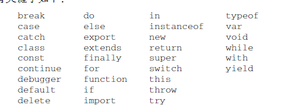
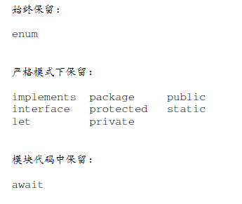
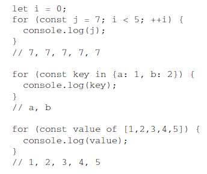
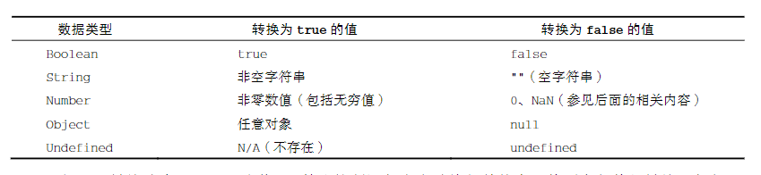
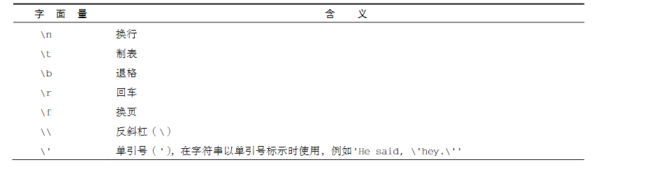
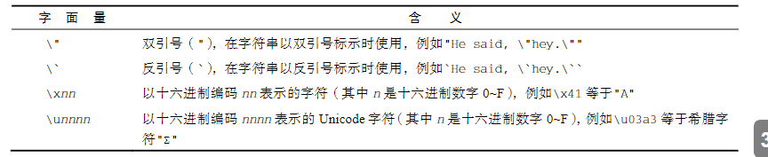
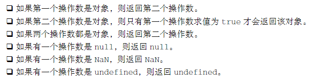
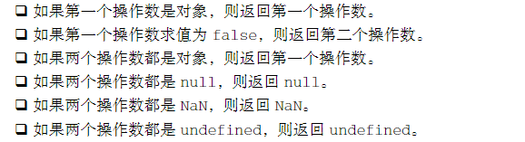
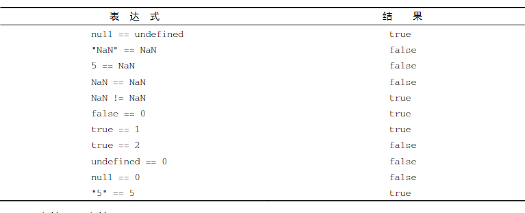
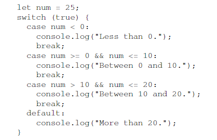

- ## ((63b2c02e-5e10-4c6e-bbcc-09781f20d1c8))
- 区分大小写
	- typeof不能作为函数名，但Typeof可以
- 标识符
	- ((63b2c143-f380-449a-9d14-1d0111652505))
	- ((63b2c14b-cdcd-4d85-8bfc-25c5c35f5344))
	- ((63b2c159-be86-44a0-81fa-3335a79dad4c))
- 严格模式 strict mode
	- 不同的javascript解析和执行模型
	- ```
	  function doSome(){
	  	"use strict"
	  }
	  ```
- 语句
	- 分号不是必须的
- ## ((63b2c224-ee25-4295-924d-681baeab0bfc))
- ES6规定的关键字
	- 
- ES6的保留字
	- 
- ## ((63b2c2af-586d-48d9-b557-ea2945eeb0df))
- 3个关键字可用来声明变量
	- var 在所有版本都可以使用
	  collapsed:: true
		- var是一个关键字
		- ((63b2c6b3-a8e4-43ef-955c-47b90da7a251))
		- var声明作用域
			- 使用var操作符定义的变量会成为包含它的函数的局部变量
			- ((63b2c71d-72b8-4d0d-9bed-480fb3a1298b))
				- 可以在函数外部访问到
				- ((63b2c780-7808-4dca-b890-89f48372508d))
		- ```
		  //松散类型
		  var message = "hi",found = false , age = 29;
		  ```
		- var声明提升 hoist
			- 所有变量声明都拉到函数作用域的顶部
	- let 只能在ES6及更晚
	  collapsed:: true
		- let声明的范围是块作用域（函数作用域的子集）
		- 不允许出现冗余声明
		- 嵌套使用相同的标识符不会报错，因为同一个块中没有重复声明
			- ```
			  let age = 30;
			  console.log(age);//30
			  if(true){
			  	let age = 26;
			      console.log(age)//26
			  }
			  ```
		- let 和var只是指出变量在相关作用域如何存在，声明冗余报错同样存在
		- ((63b2ca8d-2353-42a7-bc7c-37a67271640d))
			- let声明的变量不会在作用域中被提升
			- ((63b2caeb-3bf4-449b-9dc1-d86bf9e74a59))
				- 抛出引用异常ReferenceError
		- ((63b2cb48-0aa3-4639-9713-5c741bdbefb8))
			- ((63b2cb56-8354-47b0-8489-541496027a2d))
				- ```
				  var name = 'matt';
				  console.log(window.name);//matt
				  
				  let age = 26;
				  console.log(window.age);//undefined
				  ```
		- ((63b2cba1-1a8f-4b1d-91d4-500e2e1b8ca6))
			- ((63b2cbf9-c5a8-49ff-b3ab-65f72bda1b55))
		- for循环中的let声明
			- 使用var进行迭代变量声明会渗透到循环体外部
			- 使用let后，其作用域仅限于for循环快内部
			- ((63b2cc82-b07e-45c4-bddd-e57dc456e8fa))
	- const 只能在ES6及更晚
	  collapsed:: true
		- const与let行为基本相同，但他声明变量时必须同时初始化变量，且尝试修改时会报错
		- 同样作用域为块
			- ```
			  const name = 'maa';
			  if(true){
			  	const name = 'Nich';
			  }
			  console.log(name);//maa
			  ```
		- 不允许重复声明
		- 但如果引用的是一个对象则不影响
		- for循环中
			- 
- ## ((63b2ce0b-773e-47c9-9a8d-06723ccd57f5))
- 操作符typeof，返回下列字符串
	- undefined表示值未定义
	- boolean表示值为布尔值
	- string表示值为字符串
	- object表示值为**对象或null**
	- function表示值为函数
	- symbol表示值为符号
- 6种简单数据类型
	- Undefined
		- 特殊值，使用var或let声明了变量但没有初始化时
		- ((63b2d02b-ee53-4807-908d-42401e383cc3))
			- 对未定义变量进行typeof时不会报错，会返回undefined
		- 它是一个假值（false），
	- Null
		- 逻辑上null为一个空对象指针，typeof会返回Object
		- ((63b2d116-477f-467a-98c9-73c1f5b063b9))
			- null == undefined
		- null可以显式设置
	- Boolean
		- true 和 false
		- ((63b2d164-21ec-463d-b49b-016d43a404de))
			- Boolean("hello world");
			- 
	- Number
		- IEEE 754（双精度）表示整数和浮点值
		- 八进制第一个数字为0 + 0~7（严格模式下无效，语法错误）
		- 十六进制前缀为0x+十六进制数
		- ((63b2d236-e39f-4878-ba54-b165e432fc5d))
			- ((63b2d240-d46f-4644-9efc-382194f42961))
			- 1.0也会变为整数
		- **浮点值**可以用科学计数法表示
			- `let floatNum = 3.123e7 `
			- `let floatNum2 = 3e-17`
			- ((63b2d2a8-dd78-4795-adef-a467920361f3))
		- 浮点数精度最高可达17位小数
		- 永远不要测试某个特定的浮点值
		- ECMAscript可以表示的最小数值保存至 `Number.MIN_VALUE`(5e-324)，最大数值保存在`Number.MAX_VALUE`(1.7976931348623157e+308)
		- ((63b2d380-b580-4176-b70b-81ad8a00b250))
		- ((63b2d39a-d584-45bc-bbbb-542e8b30fbea))
			- 但两个无穷大相加是不可进行的
			- Number.NEGATIVE_INFINITY  == -Infinity
			- Number.POSITIVE_INFINITY == Infinity
		- **NaN** 意思为不是数值，用于表示本来要返回数值的操作失败了（比如0除任何数值）
			- 任何涉及NaN的操作都会返回NaN
			- NaN不等于包括NaN在内的任何值
			- isNaN()接收一个参数判断其是否为NaN，尝试转化为数值
		- **数值转换**
			- 将非数值转换为数值
				- Number() 转型函数用于任何数据类型
					- true转换为1，false转换为0
					- null返回0
					- undefined 返回NaN
					- 字符串
						- 数值转化为十进制数
						- 浮点数转化为浮点值
						- 十六进制转化为对应的十进制
						- 空字符串转为0
						- 其他情况 转为NaN
					- ((63b2d5a3-1649-4e5b-8bc4-145523e4dc59))
				- parseInt() 将字符串转化为数值
					- ((63b2d5bc-6200-4bab-a417-0f0c59494ebb))
					- ((63b2d6c1-19cc-49fd-bb17-07aca65763c0))
						- 所以空字符串将返回NaN
						- 从第一个非空格字符转化
					- 小数点和字符不是有效的整数字符，会被忽略
					- 接收第二个参数，指定底数（进制数）
				- parseFloat() 将字符串转化为数值
					- 第二次出现的小数点就无效了
					- 始终**忽略字符串开头的0**
					- 只解析10进制数，16进制(0x11)会解析为0
					- 字符串表示整数则返回整数
	- String
		- 表示0个或多个16位Unicode字符序列
		- 可使用双引号、单引号、反引号标识
		- 转义序列
			- 
			- 
			- 作为**单个字符被解释**
		- 字符串是不可变的
			- 修改只能先销毁原始的字符串，将包含新值的另一个字符串保存到该变量
		- null和undefined没有toString()方法
		- toString一般不接受参数
			- 对数值调用时，可以接受一个底数参数
			- ((63b2d858-d53a-4a08-a2ca-b840bd80b9c8))
		- **模板字面量**保留换行字符
			- ((63b2d8f4-e69e-4943-ba74-0f539beb636e))
			- **字符串插值**：在一个连续定义中插入一个或多个值
				- ((63b2d922-fdd9-46d5-8692-ca070c5df4c5))
				- 使用${ } 进行插入
			- **标签函数** tag function
				- 标签函数可以自定义插值行为
				- 剩余操作符 (rest operator)
					- `function simpleTag(strings,...expressions)`
			- **原始字符串**
				- ((63b2dac7-5456-4a3b-a568-4cbe18d9b5d1))
					- 默认的String.raw 标签函数
						- String.raw`first\nsecond`
					- ((63b2db65-ce96-4e92-a064-93f2a78c0db2))
	- **Symbol**
		- 原始值，且符号实例是唯一的、不可变的
		- 确保对象属性使用唯一的标识符，不会发生属性冲突
		- ((63b2dba6-e1d5-4e16-b16e-506020667547))
			- ((63b2dbc5-4267-4217-9b93-f2286abbf272))
		- ((63b2dbfb-4f18-48fe-a535-fdd9adcea9af))
			- 若使用符号包装对象，借用Object()函数
		- ((63b2dc64-6d9d-4cec-997e-26fc9331f535))
			- Symbol.for()创建并重用符号
			- Symbol.keyfor()查询全局注册表
		- ((63b2dd0b-e24e-4223-908b-3519659a88f7))
			- ((63b2de45-08d5-44cf-961c-8173f779af1d))
			- ((63b2de4f-0594-406c-942b-d22c73908ef3))
			- ((63b2df37-528a-41e6-b5d4-81bb8c11c412))
		- ((63b2df6e-5853-49cf-849b-42994aa2362d))
			- well-known symbol,用于暴露语言内部行为
			- ((63b2dfcc-3e24-4925-a808-24830df6ae31))
		- ((63b2dfd3-9011-4aaa-b512-0c5373d2068d))
			- 表示实现异步迭代器API的函数
			- ((63b2e04a-bfc5-4d89-ab2b-906c6875b418))
			- ((63b2e052-4203-493b-918d-78d0aca430dc))
		- ((63b2e05d-97d4-46a9-92bd-3da8a822843f))
			- 表示一个方法
			- 决定一个构造器对象是否认可一个对象是他的实例
			- 由instanceof操作符使用
			- ((63b2e0f1-04d4-4070-a5f9-4a497a591d66))
			- 可以在继承的类上，通过静态方法重新定义（覆写函数）
		- ((63b2e132-c0f1-4bad-b02e-d740bf26ead5))
			- 表示一个布尔值
			- ((63b2e1b2-385e-4d8c-aaa0-1a9cd9997fec))
			- ((63b2e1be-0837-46ba-831b-64e18ae16a90))
		- ((63b2e1d8-dabf-4cee-9f24-52cb3c085e07))
			- 表示一个方法
			- 返回对象默认的迭代器，由for-of语句使用
			- 返回迭代器API的函数
		- ((63b2e278-90d0-43f2-8af2-38243a38b3e6))
			- 表示一个正则表达式方法
			- ((63b2e291-390a-4201-a6ea-5349d3244fd8))
			- ((63b2e2c1-29f4-4c9a-abb8-02ca7b6f8d33))
		- ((63b2e303-fad1-4d25-ba7f-5591e4ab3acf))
		- ((63b2e30c-64e2-4791-a75b-eb1c92f14700))
		- ((63b2e314-c257-462f-86e2-fd3c1ff6ecc9))
		- ((63b2e31c-33fe-4383-9c9c-0e563fed4fd0))
		- ((63b2e326-b3f0-4788-8188-c76e467f7669))
		- ((63b2e32d-f7b0-40dd-9feb-656a62b5627e))
		- ((63b2e33a-5c01-49ca-943d-28de5327e640))
- 1种复杂数据类型
	- Object
		- constructor
		- hasOwnProperty(propertyName)用于判断当前对象实例是否存在给定属性
		- isPrototypeof(propertyName)用于判断当前对象是否为另一个对象的原型
		- propertyIsEnumerable(propertyName)用于判断给定属性是否可以使用
		- toLocaleString()返回对象的字符串表示，反映对象所在本地化执行换进
		- toString()
		- valueOf()
- ## ((63b2e41a-3d2c-4482-9200-950b5f94ac6b))
- ((63b56867-a1cd-41c8-a2a4-ba4bd7a63c5e))
- ### ((63b56880-ea21-4536-81d1-64b24c3bd484))
	- ((63b5688f-eb0a-402b-8d6c-d2c8489c0952))
		- 对于布尔值，false变为0，true 变为1
		- 对于字符串，非有效数值形式，变为NaN
	- ((63b5695c-1e36-4518-b9bb-5d43cedd7bee))
- ### ((63b56a1d-2843-482b-bd41-8bdca0730fb2))
  collapsed:: true
	- ((63b56a37-f75d-4ff2-a0ab-1b4cbf926723))
	- ((63b56a43-8c13-41ac-be50-ecc34c72141d))
	- ((63b56ada-2d40-4978-ac32-6d46adcd9aed))
	- ((63b56b2f-fb7e-4790-8596-5730cd210065))
	- ((63b56b7e-3f77-4ca4-a68d-5cc958be6033))
	- 按位非
		- ((63b56c2a-55d6-4c24-9c5f-9e5bd784fb5d))
		- ((63b56c36-f313-4f94-809b-b58a60e7207f))
		- 速度快很多
	- 按位与
		- ((63b56d01-cff7-4faf-8f55-8953bcf4647f))
	- 按位或
		- ((63b56db9-61e2-45cb-9890-80a782a1f261))
	- 按位异或
		- ((63b56ed8-794d-422c-94e9-52f44a343250))
	- 左移
		- ((63b56ee6-e3ba-49aa-9c3b-55d67a54e72d))
		- ((63b56f28-3254-402d-b871-c687c177f12d))
	- ((63b56f44-9259-4950-a317-2c739e2227f8))
		- ((63b56f50-fe08-4cda-ac42-c64dc84126af))
		- ((63b56fca-0bcc-4e34-acdc-9397c6764441))
	- ((63b56fae-3f05-4672-abf9-4cd9f33effba))
		- ((63b5700a-7f95-4ede-a927-1fe327cca27f))
		- **无符号右移会给空位补0，符号位也会依次右移**
	-
- ### ((63b571ab-1933-4e99-bc18-af510e70b1db))
	- ((63b571c0-0583-4399-939b-23011d3c0b09))
	  id:: 63b571b3-d4e2-4286-b842-981e6f4e738c
	  collapsed:: true
		- 由一个叹号表示
		- 操作数是对象，返回false
		- 操作数是空字符串。返回true
		- 操作数是非0数值，包括Infinity，返回false
		- 使用两个叹号，相当于调用的转型函数Boolean()
	- ((63b573cd-6484-4c8f-80b5-9a3e911dff55))
	  collapsed:: true
		- ((63b5746e-f392-47f8-99c7-87da08d949b9))
		- 只有两个操作数都为true的时候，结果为true
		- 
		- ((63b574e0-5cca-49af-85d3-7d5d42270248))
			- 即第一个操作数是false，则不用管第二个数是否被定义。否则会报错
	- ((63b575ca-9c01-4bac-a479-75d1d22dd7f3))
	  collapsed:: true
		- ((63b575e1-8c58-4769-9372-528e7d96dc84))
		- 
		- 也是一种短路操作符，第一个操作数为true，则不用管第二个操作数是否被定义，改为false则会报错
		- ((63b576d2-48cc-47db-854b-0d1112f997d2))
			- 可以避免给变量赋值null或undefined
			- 如果preferredObject是null，则backupObject的值会赋给myObject
- ### ((63b578db-a9c5-4434-9165-464e20ca8815))
	- ((63b579e6-8fe0-4217-9801-72ae12bc4bb6))
		- 如果有任一操作数为NaN，返回NaN
		- Infinity * 0 = NaN
		- Infinity乘以非0的有限数值，根据第二个的符号返回Infinity或-Infinity
		- Infinity*Infinity = Infinity
	- ((63b579fa-4898-4ccd-a12a-7a71b2b0a432))
	- ((63b57a0f-9f3f-45ad-94e0-5c558632e5c7))
		- ((63b57a1a-5c4f-4511-b005-c8f617d1336c))
		- 被除数是0，除数不是0，则返回0
- ### ((63b57adf-beb6-4c01-9746-4320ce30c8bf))
	- ((63b57af8-d0ad-4a66-98f0-086b290dc163))
	- ((63b57aff-38dd-4ce0-8335-f4a0c167564d))
- ### ((63b57b35-eb63-4ec3-843d-1c8a499c46e4))
  collapsed:: true
	- ((63b57b48-7df0-4a5f-ab16-b9f63052fef7))
		- ((63b57bc1-d452-4d08-8f27-b5efa71a3a78))
		- ((63b57c1b-a0a9-4e12-93c5-f80440b5ce97))
		- 字符串在后面相加
		- ((63b57c56-f1e8-4a0c-910f-7bb789cf9d34))
			- 5+“5” = “55”
	- ((63b57ce7-4317-49d8-b6e8-b9570bdd85e2))
		- ((63b57cfa-16d3-4d38-8906-054d36ecc82a))
		- ((63b57d14-0d4d-4a87-9272-463165868f47))
		- ((63b57d27-24e1-4cf9-bc3b-347242195e80))
		- null和undefined被Number()转为0
- ### ((63b57d6f-81a0-452d-874b-df87a4dde944))
	-  如果操作数都是字符串，则**逐个比较**字符串中对应字符的编码。
- ### ((63b57fa3-3c9c-4908-9597-586c2b0c5cce))
	- 
	- ((63b580c7-fd7c-4818-858d-92356f01b507))
	- ((63b580d6-05f3-4713-a027-146e5ffc7363))
- ### ((63b580dd-4b0a-44b4-acde-7f378162f9e9))
	- ((63b5810f-4e1e-4edd-b792-127271bcf3e5))
- ### ((63b580f3-c054-4223-bc53-f04577b9a8fc))
	- 并不能提升性能
- ### ((63b580fb-16f2-4874-bb47-01a959304e3c))
	- ((63b582cf-eb35-4c15-9337-bf4c081f9d2d))
- ## ((63b2e434-f487-4760-9c5e-4ecaff09863a))
	- ((63b58321-da1c-40e8-b506-5e6d7f3339d7))
	- ((63b58336-fee9-4ce9-920c-b9e67dce1059))
	- ((63b5833e-c903-4938-a353-fb73f3789254))
	- ((63b58346-c7ce-4857-930a-7dded1639c4f))
	- ((63b58352-12a2-4b13-9251-ede479c39ec8))
		- 严格的迭代语句，用于枚举对象中非符号键属性
		- 不能保证返回对象属性的顺序
		- ((63ba22a7-2d98-405a-860f-8ace3b57b7f2))
	- ((63b58361-8f28-463a-ab1f-2a525e5353f0))
		- 严格的迭代语句，用于遍历可迭代对象的元素
		- 会按照可选迭代对象的next()方法产生值的顺序迭代元素
		- 不支持迭代，会抛出错误
	- ((63b5836c-f673-4414-9de3-9309ff40a6b9))
		- 为语句加标签
		- `label : statement`
		- 应用场景为嵌套循环，通过break和continue语句引用
	- ((63b58376-a637-4872-805c-61cf3504bc11))
		- ((63ba2626-24a8-4a18-b487-1c2ffac39fa4))
	- ((63b58387-dd7e-4b5c-bd34-19956c9b66d4))
		- 将代码作用域设定为特定的对象
		- 针对一个对象反复操作
		- 严格模式下不允许，影响性能
		- `with (expression) statement;`
		- ```
		  with(location){
		  	let qs = search.substring(1);
		      let hostName = hostname;
		      let url = href;
		  }
		  //每个变量首先会被认为是一个局部变量，如果没有找到，会搜索location对象
		  ```
	- ((63b58395-70fc-4d6c-b5df-6e394204a48b))
		- 可以用于所有数据类型
		- 
	-
- ## ((63b2e447-e5b9-444f-8f5c-d921d3e0620f))
- ((63ba2fb8-5815-483f-8c79-07b7ec2e4123))
-