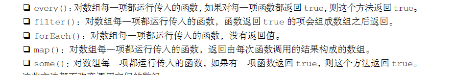

- ## ((63be5ffb-0403-4793-a0a9-4df65b6dabc1))
- 创建Object实例方法
	- 使用new操作符创建
	- 使用对象字面量（object literal）表示法
		- ((63be61ab-f742-4988-884e-2244fdbfb7f0))
		- ```
		  let person = {
		  	name :"niack",
		      age :20,
		      5: true
		  }
		  
		  let person = {};
		  person.name = "Dw";
		  ```
		- ((63be61f0-889b-4835-9c76-54bb2e69091a))
- 可以 使用中括号来存取属性
	- `person["name"]`
-
- ## ((63be6267-9bbe-4767-abed-355875869d86))
- ((63be62c0-c47a-46da-a1e9-bc013b0b9c6b))
- 使用Array构造函数
	- `let colors = new Array();`
	- `let colers = new Array(20);`
	- `let colors = new Array("red")`;
	- 可以省略new操作符
- 使用数组字面量(array literal)表示法
	- 在中括号中包含以逗号分隔的元素列表
	- `let colors = new ["red","blue"];`
	- `let names = [];`
- ((63be6385-8a48-4253-aabf-b893d03e4d9d))
	- ((63be644d-9337-4d0e-ab21-d834b4a155b8))
	- ((63be6455-ebda-475a-8faf-26e11b1efd6a))
	- ((63be645c-544b-4f4c-b25d-92a14ca2f754))
	- ((63be6462-4669-4baf-8497-d15634c33d7f))
	- ((63be6468-2990-4970-914e-98f5732a0e78))
		- arguments对象存储的是实际 传递给函数的参数，而不局限于函数声明所定义的参数列表，而且不能显式创建 arguments 对象
	- ((63be6484-ba49-4c2a-854d-9807df101535))
- ((63be638c-129a-4609-91eb-f5e9b7845b1b))
-
- ((63be64bd-7bba-4547-a690-799f00a62f50))
- ((63be64e0-9bc8-4dd1-beac-8b2f4800e640))
- ((63be64f6-06cf-4ba9-a1a0-f3f2ff2c4301))
-
- ((63be65c2-3cef-4a1f-96b7-3e08982f9348))
- ((63be65e6-2f5b-468e-b6e9-5885c63f6020))
  id:: 63be65c5-4fe1-43d9-939f-fa51d2d0abea
	- 通过修改length属性，可以从数组末尾删除或添加元素
- ((63be6612-ae52-49d9-8052-8496625017b1))
-
- ((63be6619-d53d-47c8-a734-adfa5a858c2a))
- ((63be67fa-8b8e-4d98-8ed1-a8dfd366eaab))
- ((63be680d-867c-45c8-81ae-46116253d9de))
	- 确定一个值是否为数组
-
- ((63be6819-06c4-40a7-b655-124019baf173))
- ((63be682d-0853-4744-844c-777efbcf076d))
- ((63be6834-26ad-4fa3-976c-ecbf117e25ac))
- ((63be683a-5110-4b28-b35e-d445c73535ce))
- ((63be6848-95a1-4015-9984-14fb9ad436ea))
-
- ((63be6850-f1bc-44e8-b76e-aedf880a39f0))
- ((63be6860-a1ff-4428-a389-3026daffae0e))
	- ((63be6961-64f7-4980-becc-97b6fb07916a))
		- `zeroes.fill(7,1,3);`
- ((63be68a3-53ee-422a-b914-dc7c02dca9fe))
	- 从 ints 中复制索引 0 开始到索引 3 结束的内容，插入到索引4开始的位置
		- `ints.copyWithin(4,0,3);`
-
- ((63be69b1-634e-4812-ab69-303f4d211c69))
- ((63be6c1b-0f91-4b35-9917-d648ca947704))
- toLicaleString方法 ((63be6c15-490e-4c1d-b7c9-e19afe5338bf))
- ((63be6c5d-4be7-4e0c-8f34-48d0f4f48a6e))
-
- ((63be69b9-7167-4a3c-b82c-6db9e4d80646))
- ((63be71cd-9d87-4f96-aeea-731b79761aca))
- ((63be7332-53b9-4338-a3dd-0c555a2289d6))
-
- ((63be69be-cb53-4d8e-b49f-dab7fd687af7))
- ((63be7366-89d7-4ccd-afc6-fe6769452595))
- ((63be7372-1c4f-472b-abd5-4716f2fe3942))
- ((63be76e5-fa0c-4e5b-a317-77fd39ada962))
-
- ((63be69c4-b681-4ad8-b3cc-ab81d331709e))
- ((63be76f2-9861-408c-88c1-dae1053b0d32))
- ((63be774b-dd42-4a63-b01f-ce071a7f890f))
	- 默认比较字符串决定顺序
	- ((63be776f-de22-435b-8f39-7bd438fda891))
		- ((63be77aa-4eef-41e1-b4d9-341814f7a161))
-
- ((63be69d0-436c-4d19-ac9f-87aeb37c7bb4))
- ((63be787a-a0f8-41b7-b5a2-752bbe933c73))
	- 创建一个新数组，添加每一个数组的每一项（默认打平所有数组）
	- ((63be78a5-6759-42cb-81a9-5fb204caba7b)) 设为false，阻止打平
- ((63be7942-cfbc-487e-a1b1-f9bc384307f9))
	- 删除
		- 开始索引和结束索引
	- 插入
		- 开始位置，要删除的元素数量 0、要插入的元素（可以有多个字符串）
		- `splice(2,0,"red","green");`
	- 替换
		- 开始位置，要删除的元素数量，要插入的多个元素
- ((63be69d9-6fe8-4dcd-81d3-208a6b29c739))
- 严格相等
	- indexof()从前往后搜索，返回位置
	- lastIndexof()从尾往后
	- includes()从前往后搜索，返回布尔值
- 断言函数
	- 元素、索引、数组；返回真值
	- ((63be7c46-4081-4b5c-8830-9e94ad4dd4ec))
	- ((63be7c4e-8b3b-4870-a60d-a0088c3ce20a))
	- ((63be7ca0-5ded-405a-af45-ad5e49dcd4b1))
	- ((63be7cb9-6d53-426f-b756-7fa27b50eb36))
- ((63be69e1-882f-4190-8326-70212b9e3937))
- ((63be7cd3-abe0-4e38-9373-2c2c86a34721))
- ((63be7cdc-89aa-4c0e-84ca-8019251a531c))
	- （item,index,array）=>
- 
- ((63be7fc0-eae6-411a-a490-388ff18ab7fd))
- ((63be7fdf-bc96-4d9a-9932-fea0980a62ba))
-
- ((63be69e7-1040-486d-a71d-d579ec3cbdb1))
- ((63be800b-f488-4335-8f24-6e0226778428))
- ((63be8010-73b7-439f-9a06-e832ffc2bfba))
- 四个参数
	- ((63be8105-562d-431a-a28c-f0d0879fee48))
-
- ## ((63be6a08-fb0d-4102-91dc-de90944e1ae6))
- ((63bea918-b9a5-494d-8ac1-e1acc48efb6b))
- ((63bea92c-62f3-4a5a-b63b-818756fe52da))
- ((63bea936-f176-410b-84a8-52e29b8146c8))
-
- ((63bea9f5-6afa-4353-972e-3f8d28e56a3c))
-
- ## ((63be6a22-4b5f-422e-a201-13babab8dd75))
- ((63beac7e-e044-43cd-8088-6bdbf4d37148))
- 初始化时可以使用嵌套数组、自定义迭代器、空的键值对
- 使用set方法添加键值对
- 使用get和has方法进行查询
- 使用delete和clear删除值
- 通过size属性获取映射中的键值对数量
- ((63beac71-af4d-4c45-89c4-66f754545e5f))
-
- ((63beac8c-49fb-4927-ab83-10deec98e9f1))
- ((63beacaa-bd51-4299-be85-fb036e40b3a3))
	- ((63beacc6-cd03-4068-a720-d5564d546571))
	- ((63beacd4-cd9b-44b1-92a0-3cacc3f37fc1))
- ((63bead95-c27a-4a33-a6f9-d929b7667259))
- ((63beadaa-b7b6-4a0a-aa95-e1a44fcfed1d))
- ((63beaecf-7965-44bb-9b1f-79aca1ef3b3d))
-
- ((63beaefe-542d-4db0-a239-f3f754e03111))
- ((63beaf0c-e895-4107-80aa-764f72356357))
- ((63beafa7-ba78-483f-bac3-4041047eb57d))
- ((63beafb7-443a-40f4-bdfb-0791eed57a3e))
- ((63beafcc-b7ba-4a9e-998f-b4fd109b716c))
-
- ## ((63be6a30-3d34-4f5e-a995-cc8d644c6c67))
- ((63beafd8-f73f-4426-b8f4-74f44257858a))
- ((63beb026-805f-4267-b455-f43c5c8180b4))
- 使用嵌套数组初始化弱映射
- 初始化是全有或全无的操作
- 原始值可以先包转成对象再用作键
- set、get、has、delete、
- ((63beb1c7-02b5-4070-aecf-68f0a1e98c6b))
- ((63beb1d5-f29a-42e4-8625-eea2a65aba35))
- ((63beb214-e271-49e3-8655-6b42ec2b15f8))
- 没有clear方法
- ((63beb2da-e319-4684-a191-ab8daa677169))
- ((63beb294-8369-4334-8bb2-5b932d743636))
-
- ## ((63be6a3f-9238-435f-b044-c399dd08dc80))
- ((63beb368-5074-47f1-90ad-114328dda759))
- ((63beb37c-f64b-4174-8555-a667080690fa))
- 使用数组初始化集合
- 使用自定义迭代器集合
- add增加值，has查询，size取得元素数量，delete和clear删除元素
-
- ((63beb534-1098-42e1-a16b-c595426f301d))
- ((63beb573-943c-425c-92c6-a7651807ee96))
- ((63beb591-e55e-4009-8e29-9944a11aa44f))
- ((63beb5b3-db3a-4018-9837-3159c0a42b7b))
-
- ((63beb602-dcb6-45b2-bf6e-ed79df318abe))
-
- ## ((63be6a52-728f-428b-a100-de15e47fa9dc))
- ((63beb6bf-7356-4f24-8af1-16524da3c8c7))
- ((63beb83d-ee81-472f-adbe-8ce629cf4acd))
-
- ## ((63be6a5d-63a1-415d-8e5d-b58fda46ccaa))
- ((63beb8b9-8bc8-406c-b3e5-617884384140))
- ((63beb8fa-a0bd-4313-9aa1-9734ff48394e))
-
-
- 数组加三点，表示将数组内元素以空格为罗列出来，常用于寻找数组内的最优值
  background-color:: green
-